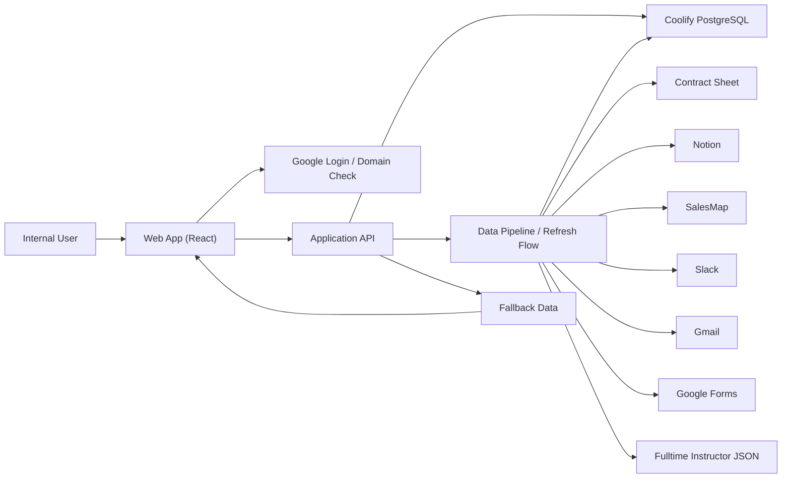

# System Architecture

## Role
이 문서는 서비스가 어떤 구성 요소로 이루어져 있고, 각 구성 요소가 어떻게 연결되는지 정의한다.
기술 스택, 서비스 구성, 배포 환경, 인증/접근 제어, 외부 의존성, 환경변수 및 시크릿 관리 방식을 포함한다.

## Source of Truth
- 기술 스택
- 서비스 구성도
- 배포 환경
- 인증 및 접근 제어 방식
- 외부 의존성 목록
- 환경변수 및 시크릿 관리 방식

## Depends On
- `00_docs_index.md`
- `01_core_policy.md`
- `03_data_model.md`
- `04_data_pipeline.md`
- `05_api_spec.md`

## Used By
- `06_implementation_spec.md`
- `07_build_guide.md`

## Out of Scope
- 세부 DB 스키마 정의
- API 요청/응답 스키마 정의
- 화면 기능 정의
- 외부 API SDK 사용 예시

## 1. 아키텍처 목표

- 하나의 내부 운영 서비스 안에서 목록, 상세, 점수, 운영 인텔리전스, 만족도 작성, 새로고침을 함께 제공한다.
- 외부 데이터 소스는 파이프라인을 통해 마스터 데이터로 통합하고, 서비스는 마스터 데이터 기준으로 동작한다.
- 일부 소스나 최신 조회가 실패해도 마지막 정상 데이터 및 fallback 데이터로 서비스 가용성을 유지한다.

## 2. 기술 스택

### 2-1. 프론트엔드
- 웹 애플리케이션
- Next.js 기반 프론트엔드
- TypeScript 사용
- Tailwind CSS 사용
- 서버 상태 관리는 TanStack Query를 사용한다.
- 클라이언트 상태는 React `useState`와 URL params를 사용한다.
- 전역 상태 라이브러리는 이번 버전에서 사용하지 않는다.
- 브라우저에서 내부 사용자 인증 세션을 사용해 API를 호출한다.

### 2-2. 백엔드
- Next.js 애플리케이션 내 Node.js 기반 API 레이어를 사용한다.
- 프론트엔드와 동일 서비스 경계 안에서 API를 제공한다.
- 목록 조회, 상세 조회, 상태 조회, 새로고침, 만족도 작성 API를 제공한다.
- 사용자용 조회/작성 API와 운영/관리용 파이프라인 트리거 API는 분리한다.
- DB 접근 ORM은 Prisma를 사용한다.

### 2-3. 데이터 저장소
- 기본 저장소: Coolify PostgreSQL
- 마스터 데이터, 이력 데이터, 설정 데이터, 검증 로그, 파이프라인 실행 로그를 저장한다.
- 애플리케이션은 Prisma를 통해 PostgreSQL 스키마, 마이그레이션, 쿼리 접근을 관리한다.

### 2-4. 인증
- Google 로그인
- `@day1company.co.kr` 도메인 제한

### 2-5. fallback 저장
- 마지막 정상 저장 데이터는 주 저장 구조 안에서 유지한다.
- 정적 baseline 데이터는 애플리케이션 리소스로 별도 보관한다.

## 3. 서비스 구성

서비스는 아래 구성 요소로 이루어진다.

- 프론트엔드 웹 앱
- API 레이어
- 데이터 파이프라인 레이어
- Coolify PostgreSQL
- 외부 데이터 소스
- fallback 데이터 리소스

## 4. 서비스 구성도

## 5. 구성 요소 역할

### 5-1. 프론트엔드 웹 앱
- 목록, 검색, 필터, 정렬, 상세 패널 UI를 제공한다.
- 점수, 운영 인텔리전스, 강의 이력, 단가 이력, 운영 메모를 렌더링한다.
- 만족도 작성 UI와 새로고침 UI를 제공한다.

### 5-2. API 레이어
- 프론트엔드 요청을 받아 Coolify PostgreSQL 기준으로 데이터를 반환한다.
- fallback 여부와 데이터 상태를 응답 meta에 포함한다.
- 만족도 작성과 새로고침 요청을 처리한다.
- 소스별 파이프라인 실행은 운영/관리용 내부 API로 분리할 수 있다.

### 5-3. 데이터 파이프라인 레이어
- 외부 소스를 수집한다.
- 강사 동일인 판정 및 병합을 수행한다.
- 검증 및 자동 수정 로직을 적용한다.
- 점수를 계산한다.
- 최종 마스터 데이터를 Coolify PostgreSQL에 저장한다.

### 5-4. Coolify PostgreSQL
- 서비스의 Source of Record 역할을 한다.
- 최신 마스터 데이터와 실행 로그를 저장한다.
- 마지막 정상 저장 데이터를 유지한다.

### 5-5. fallback 데이터
- 최신 데이터와 마지막 정상 데이터 모두 사용할 수 없을 때 기준 데이터로 사용한다.
- API는 fallback 사용 여부를 사용자에게 명시적으로 전달한다.

## 6. 배포 환경

### 6-1. 애플리케이션 배포
- 웹 앱과 API는 Coolify self-hosted application으로 배포한다.
- 프론트엔드와 API는 동일 서비스 도메인 또는 동일 프로젝트 배포 환경 아래에서 운영한다.

### 6-2. 데이터 저장소 배포
- PostgreSQL은 Coolify PostgreSQL resource에서 운영한다.
- 운영 데이터와 로그 데이터는 Coolify PostgreSQL에 저장한다.

### 6-3. 파이프라인 실행 방식
- 이번 버전은 수동 새로고침을 기본 실행 경로로 제공한다.
- 향후 배치 실행이 추가되더라도 동일한 파이프라인 구조를 사용한다.

## 7. 인증 및 접근 제어

### 7-1. 로그인
- 사용자는 Google 로그인으로 인증한다.
- 허용 도메인은 `@day1company.co.kr`만 인정한다.

### 7-2. 접근 제어
- 허용 도메인이 아닌 사용자는 서비스 접근이 불가능하다.
- 이번 버전에서는 로그인한 사용자 모두 동일 권한을 가진다.
- 세부 역할 기반 권한 분리는 이번 버전 범위에 포함하지 않는다.

### 7-3. 세션 처리 원칙
- 프론트엔드는 로그인된 세션 기준으로 API를 호출한다.
- API는 세션이 없거나 허용 도메인이 아니면 요청을 거부한다.

## 8. 외부 의존성

### 8-1. 데이터 소스 의존성
- 계약시트 (Google Sheets API)
- 노션 API
- 세일즈맵 GitHub release 스냅샷
- 슬랙 MCP 연결
- 지메일 MCP 연결
- Google Sheets API
- 전임강사 JSON

### 8-2. 인증 의존성
- Google OAuth 또는 Google 로그인 연동

### 8-3. 배포/운영 의존성
- Coolify application deployment
- Coolify PostgreSQL

## 9. 데이터 흐름

### 9-1. 일반 조회 흐름
1. 사용자가 웹 앱에 로그인한다.
2. 프론트엔드가 API를 호출한다.
3. API는 Coolify PostgreSQL의 마스터 데이터를 읽는다.
4. 데이터가 정상이면 live 또는 stored 모드로 응답한다.
5. 문제가 있으면 fallback 정책에 따라 응답한다.

### 9-2. 새로고침 흐름
1. 사용자가 새로고침 버튼을 클릭한다.
2. API가 데이터 파이프라인 실행을 트리거한다.
3. 파이프라인이 각 소스의 업데이트 여부를 조회한다.
4. 변경 데이터가 있으면 병합, 검증, 저장을 수행한다.
5. 성공하면 최신 상태를 반환한다.
6. 실패하면 마지막 정상 데이터 또는 fallback 데이터를 유지한다.

### 9-3. 만족도 작성 흐름
1. 사용자가 상세 화면에서 만족도를 작성한다.
2. 프론트엔드가 만족도 작성 API를 호출한다.
3. API가 `satisfaction_records`에 저장한다.
4. 강사별 만족도 집계값을 갱신한다.
5. 저장된 canonical 값 기준으로 전체 강사의 점수와 순위를 재계산한다.
6. 상세 화면이 최신 만족도와 점수 기준으로 다시 렌더링된다.

## 10. 장애 및 fallback 구조

- 일부 외부 소스 실패는 전체 서비스 중단으로 간주하지 않는다.
- 일부 소스 실패 시 가능한 범위에서 partial 갱신을 수행한다.
- 최신 데이터 조회 실패 시 마지막 정상 저장 데이터를 사용한다.
- 마지막 정상 저장 데이터도 없으면 정적 baseline 데이터를 사용한다.
- fallback 사용 여부는 API 응답과 화면 배너에서 모두 표시한다.

## 11. 환경변수 및 시크릿 관리

### 11-1. 원칙
- 환경변수와 시크릿은 코드 저장소에 직접 저장하지 않는다.
- 배포 환경의 시크릿 관리 기능을 사용한다.
- 로컬 개발 환경에서는 별도 비공개 환경 파일로 관리한다.

### 11-2. 관리 대상
- Google 인증 관련 키
- DB 접속 정보
- 노션 접근 키
- 세일즈맵 스냅샷 접근 정보
- 슬랙 API 접근 정보
- 지메일 API 접근 정보
- Google Sheets 접근 정보
- 애플리케이션 내부 서명 키 또는 세션 키

### 11-3. 예시 환경변수 범주
- `GOOGLE_CLIENT_ID`
- `GOOGLE_CLIENT_SECRET`
- `SESSION_SECRET`
- `AUTH_URL`
- `DATABASE_URL`
- `NOTION_API_KEY`
- `NOTION_DATABASE_ID`
- `SALESMAP_RELEASE_URL`
- `SALESMAP_SNAPSHOT_PATH`
- `SLACK_BOT_TOKEN`
- `SLACK_WORKSPACE_ID`
- `GMAIL_CLIENT_ID`
- `GMAIL_CLIENT_SECRET`
- `GMAIL_REFRESH_TOKEN`
- `GMAIL_ACCOUNT_EMAIL`
- `GMAIL_TARGET_ADDRESSES`
- `GOOGLE_CONTRACTS_SPREADSHEET_ID`
- Google OAuth redirect URI는 실제 앱 origin과 정확히 일치해야 한다.
- 예: 로컬 HTTPS 프록시가 `https://localhost:8080`이면 redirect URI는 `https://localhost:8080/api/auth/callback/google`

현재 버전의 canonical 환경변수 이름은 위 목록을 사용한다.
- Notion 수집기는 `NOTION_API_KEY`, `NOTION_DATABASE_ID`를 필수로 사용한다.
- 계약시트 수집기는 `GOOGLE_CONTRACTS_SPREADSHEET_ID`를 필수로 사용한다.
- 계약시트 접근은 Google Sheets API를 Google user OAuth refresh token 방식으로 호출한다.
- 계약시트, 강사별 출강시트, 만족도 시트는 동일한 Google user OAuth 계정 권한 범위 안에서 접근 가능해야 한다.
- 세일즈맵 수집기는 현재 단계에서 local SQLite snapshot file을 사용하며 `SALESMAP_SNAPSHOT_PATH`를 필수로 사용한다.
- `SALESMAP_RELEASE_URL`은 후속 자동 다운로드 단계가 생길 때 사용하는 배포/획득 경로로 남겨두며, 현재 Pilot 4-3의 직접 실행에는 사용하지 않는다.
- Slack 활동 수집기는 direct Slack API를 사용하며 `SLACK_BOT_TOKEN`, `SLACK_WORKSPACE_ID`를 필수로 사용한다.
- Gmail 활동 수집기는 direct Gmail API를 사용하며 OAuth refresh token 방식의 `GMAIL_CLIENT_ID`, `GMAIL_CLIENT_SECRET`, `GMAIL_REFRESH_TOKEN`, `GMAIL_ACCOUNT_EMAIL`, `GMAIL_TARGET_ADDRESSES`를 필수로 사용한다.
- `GMAIL_ACCOUNT_EMAIL`은 실제 로그인 가능한 Gmail/Workspace 계정 주소를 사용한다.
- `GMAIL_TARGET_ADDRESSES`는 해당 계정 mailbox 안에서 검색할 그룹/수신 대상 주소의 comma-separated 목록을 사용한다.

## 12. 로그 및 관측성

- 파이프라인 실행 로그는 DB에 저장한다.
- 소스별 수집 결과는 DB에 저장한다.
- 검증 및 자동 수정 결과는 DB에 저장한다.
- 새로고침 성공/실패와 fallback 사용 여부는 API 및 이벤트 로그에 반영한다.

## 13. 이번 버전의 아키텍처 원칙

- 화면은 원본 소스를 직접 다루지 않고 마스터 데이터만 사용한다.
- 병합 규칙, 점수 규칙, 전임강사 정책은 아키텍처가 아니라 정책 문서 기준으로 관리한다.
- 아키텍처는 서비스 조각과 연결 방식만 정의하고, 세부 데이터 규칙은 별도 문서를 따른다.
